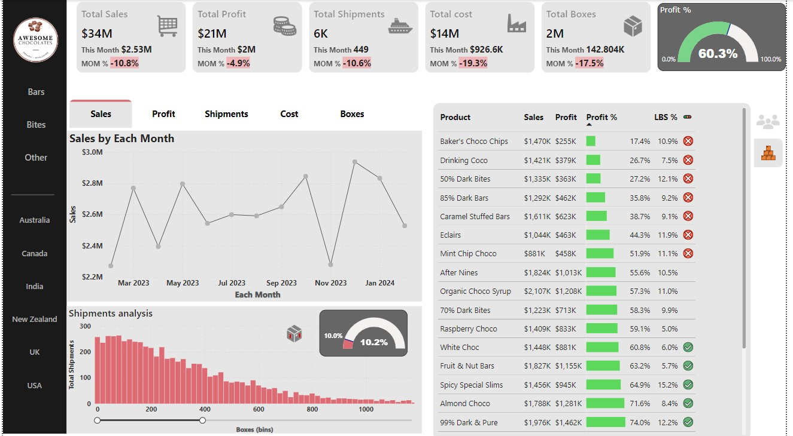

# Awesome Chocolates Sales Analytics Dashboard

### Power BI Portfolio Project 

---

## 📊 Project Overview

Welcome to the **Awesome Chocolates Sales Analytics Dashboard**, a comprehensive Power BI project designed to analyze the sales and shipment performance of a fictional chocolate company. The dashboard was created to provide key business insights into sales trends, profitability, and operational efficiency, making it an ideal tool for stakeholders and business leaders to make informed decisions.

This project showcases my ability to:

- **Model and transform data** to build scalable reporting solutions.
- Create dynamic **DAX measures** for advanced data analysis.
- Design interactive and visually compelling **Power BI dashboards**.
- **Present business insights** to support data-driven decision-making.

 
*(Click the image to explore the interactive Power BI dashboard)*

---

## 🚀 Business Problem

**Awesome Chocolates** needed an interactive and insightful sales dashboard to help answer the following key business questions:

1. How are sales performing monthly?
2. Which products and regions contribute the most to overall profitability?
3. What is the performance of individual salespeople?
4. How can we track **Low Box Shipments** (shipments with fewer than 50 boxes)?

The dashboard was designed to answer these questions, allowing business leaders to easily track performance, identify trends, and make data-driven decisions to improve profitability and sales efficiency.

---

## 🏗️ Key Features

### 1. **Key Performance Indicators (KPIs)**

The top section of the dashboard features **KPI Cards** that display the most important business metrics at a glance:
- **Total Sales**: Sum of all revenue generated.
- **Total Profit**: Profit after deducting costs.
- **Profit Percentage**: The profit as a percentage of total sales.
- **Total Shipments**: The total number of shipments.
- **Low Box Shipments Percentage**: Percentage of shipments that contain fewer than 50 boxes.

Each KPI card is enhanced with **conditional formatting** to highlight positive (green) or negative (red) trends, making it easier for decision-makers to focus on areas needing attention.

### 2. **Dynamic Trend Analysis**

A dynamic **line chart** allows users to toggle between various key metrics such as **Total Sales**, **Total Shipments**, **Profit**, and **Costs**. This feature is powered by **Field Parameters**, enabling users to seamlessly explore different business trends over time without navigating to separate charts.

### 3. **Salesperson Performance Table**

A detailed table showcases the performance of each salesperson:
- **Total Sales** and **Total Profit** generated.
- **Profit Percentage** for each salesperson.
- **Low Box Shipments handled**, providing insights into operational efficiency.
- **Performance Indicator**: Visual traffic lights (green, yellow, red) based on whether salespeople meet their profit targets.

This table allows management to evaluate and track team performance in real-time.

### 4. **Product and Shipment Analysis**

The dashboard also provides an in-depth analysis of product performance and shipment data:
- **Product Profitability**: Which products contribute the most to sales and profit.
- **Low Box Shipments Analysis**: A histogram displaying the frequency of small shipments, helping identify operational inefficiencies.

The **Zoom Slider** is implemented in the histogram to let users focus on specific ranges of shipments dynamically.

---

## 🛠️ Technical Approach

This project demonstrates my expertise in **Power BI** and **DAX** (Data Analysis Expressions), as well as my ability to design a data model optimized for business insights.

### Data Modeling

The dashboard is powered by a **star schema** data model, ensuring efficient querying and clean relationships:
- **Fact Table**: `Shipments` contains sales and shipment data, acting as the central hub.
- **Dimension Tables**: `Salesperson`, `Product`, `Geography`, and `Calendar` provide additional contextual information.
- **Calendar Table**: This table supports all **time intelligence** functions (e.g., month-on-month changes).

### DAX Measures

The dashboard uses a series of **DAX measures** to calculate key business metrics dynamically. Some of the main calculations include:

- **Total Sales**: Summing all sales data.
- **Total Profit**: Calculated by subtracting total costs from total sales.
- **Low Box Shipments Percentage**: Tracking shipments with fewer than 50 boxes as a percentage of total shipments.
- **Month-on-Month (MoM) Sales Changes**: Time intelligence functions used to calculate performance differences between months.

---

## 💡 Business Insights

This dashboard provides clear, actionable insights that help guide business strategy and operational decisions. Some of the main insights include:

1. **Sales Trends**: Users can track sales growth across different time periods and identify seasonal patterns. MoM sales trends help in forecasting and planning future strategies.
2. **Profitability**: The dashboard helps pinpoint the most profitable products and regions, allowing the business to focus its efforts on high-performing areas.
3. **Sales Team Performance**: Managers can quickly see which salespeople are meeting their targets and who may need support or coaching.
4. **Operational Efficiency**: The **Low Box Shipments** analysis helps identify inefficiencies in shipment operations, enabling potential cost-saving measures.

By using this dashboard, decision-makers can quickly assess the current state of the business and focus on areas of opportunity.

---

## 🎯 Power BI Features

This project leverages several advanced **Power BI features** to enhance the interactivity and usability of the dashboard:

- **Field Parameters**: Allows users to switch between different measures in a single visual (e.g., total sales, profit, and shipments).
- **Conditional Formatting**: Applied to KPIs and performance tables to visually highlight important trends.
- **Bookmarks**: Used to switch between different report views (e.g., salesperson performance vs. product performance) with a smooth, seamless user experience.
- **Zoom Slider**: Enables interactive exploration of specific ranges in the **shipment analysis histogram**.
- **New Card Visual**: Provides greater customization for KPI cards, making them visually engaging and easy to interpret.
